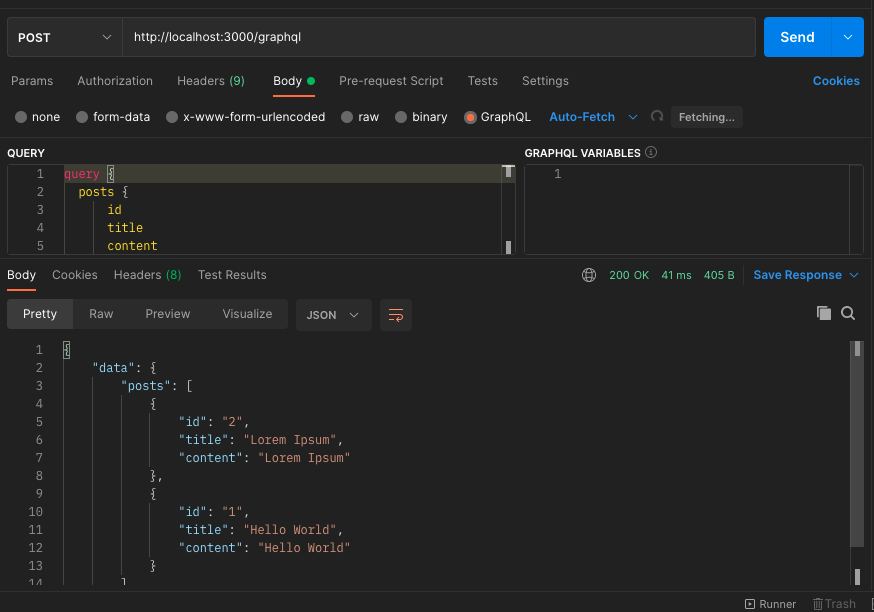

## blog-graphql-example

GraphQL memudahkan developer dalam pembuatan sebuah aplikasi. Dengan GraphQL developer hanya perlu menggunakan 1 endpoint dan menggunakan 1 method POST,
ini adalah contoh endpoint GraphQL:
```
http://namadomain.com/graphql
```

berbeda dengan REST API yang memiliki banyak endpoint, selain itu methodnya bisa beragam seperti GET, POST, PUT, DELETE.
berikut ini beberapa contoh endpoint REST API:
```
http://namadomain.com/api/posts/
```
atau
```
http://namadomain.com/api/post/1
```
atau
```
http://namadomain.com/api/user/999
```
bagaimana kalau aplikasi semakin besar dan banyak endpoint? tentu hal ini akan menyulitkan bukan? Bukan :)

Oleh karena itu Repo ini saya buat untuk sama-sama kita belajar GraphQL, mungkin jauh dari kata sempurna, tapi point pentingnya adalah kita memiliki opsi lain selain REST API.


## Getting started

untuk melihat semua Post, gunakan Query berikut:
```
query {
  posts {
    id
    title
    content
  }
}
```

untuk melihat detail Post, gunakan Query ini:
```
query {
  post(id: 2) {
    id
    title
    content
  }
}
```

untuk membuat Post baru, silahkan pakai Mutation ini:
```
mutation {
  createPost(title: "Example", content: "Example") {
    id
    title
    content
  }
}
```

Sedangkan, untuk menghapus Post gunakan Mutation ini:
```
mutation {
  deletePost(id: 3)
}
```

## Pakai Aplikasi Apa untuk test GraphQL?

Pada contoh ini saya menggunakan Postman


